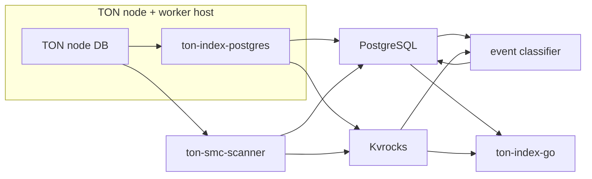

# Архитектура TON Indexer

TON Indexer состоит из нескольких независимо запускаемых процессов. Основной
поток данных начинается в локальной базе TON-ноды, проходит через index worker и
заканчивается в PostgreSQL и Kvrocks. API и дополнительные сервисы читают уже
подготовленные данные из этих хранилищ.

## Основной поток данных

## Источник данных

Index worker читает применённые TON-ноды блоки непосредственно из её RocksDB.
Worker использует собственный `working-dir` для secondary RocksDB state и
внутренних checkpoints. Поэтому `ton-index-postgres` должен запускаться на той
же машине, что и обслуживаемая им TON-нода, и читать её node DB по локальному
пути. Подключение worker к node DB на другой машине не поддерживается. Worker
также не должен разделять свою рабочую директорию с другим окружением.

Для непрерывной индексации worker определяет следующую точку обработки по
сохранённому progress. Для загрузки истории он также может обрабатывать явно
ограниченный диапазон masterchain seqno. Несколько исторических диапазонов можно
обрабатывать параллельно, если они не пересекаются.

## Обработка блоков

`ton-index-postgres` выполняет четыре основные задачи:

1. Находит нужные masterchain и shard blocks в TON node DB.
2. Загружает и парсит blocks, transactions, messages и account state changes.
3. Собирает связанные транзакции в traces и определяет protocol-specific data.
4. Сохраняет результат в настроенные хранилища и обновляет progress.

Один и тот же worker поддерживает исторический backfill и непрерывную
live-индексацию, но эти режимы имеют разную координацию и правила обновления
current state.

## Хранилища

### PostgreSQL

PostgreSQL является основным долговременным хранилищем. В нём находятся blocks,
transactions, messages, traces, actions, NFT/Jetton/staking data, служебные
очереди и состояние progress.

Схема управляется отдельным бинарником `ton-index-postgres-migrate`. Версия схемы
должна быть совместима с версиями worker, classifier и API.

### Kvrocks

Kvrocks используется для данных, которые удобнее получать по ключу:
current/latest account state, contract interfaces, message contents и другие
lookup-структуры. При включённом Kvrocks API может объединять результат запросов
из PostgreSQL с current data из Kvrocks.

PostgreSQL и Kvrocks являются независимыми системами хранения. Их progress и
поведение при failover необходимо рассматривать совместно, особенно если
репликация асинхронная.

### Redis

Redis используется как временное и событийное хранилище. В зависимости от
включённых подсистем он содержит classifier/emulation tasks, pending traces и
Pub/Sub channels для streaming API. Redis не заменяет Kvrocks и PostgreSQL.

### ClickHouse

`ton-index-clickhouse` предоставляет альтернативный путь исторической
индексации. Он не является обязательной частью стандартного PostgreSQL stack.

## Snapshot current state

`ton-smc-scanner` читает shard states на выбранном masterchain-блоке, проходит по
аккаунтам, сохраняет их состояния и определяет поддерживаемые contract
interfaces (такие как jetton wallet, nft item, etc). Scanner нужен, когда окружение должно сразу получить полный current
state на некоторой точке, не воспроизводя всю историю последовательно.

Snapshot не создаёт исторические blocks, transactions, messages и traces. Если
нужна история, она загружается отдельно через index worker.

## Traces и actions

Index worker связывает транзакции и сообщения в traces. Python classifier читает
готовые traces, распознаёт высокоуровневые действия — например transfers, swaps
и multisig operations — и записывает actions обратно в PostgreSQL.

Classifier является отдельным сервисом, потому что правила классификации и его
масштабирование не совпадают с задачами чтения блоков. Для работы ему нужны
PostgreSQL, Redis event-cache и, в конфигурациях с вынесенными contents/current
data, доступ к тому же Kvrocks.

## API

`ton-index-go` предоставляет REST API и Swagger. Основная часть запросов читает
исторические и классифицированные данные из PostgreSQL. Запросы current state и
часть обогащения ответа могут дополнительно обращаться к Kvrocks.

API не индексирует данные самостоятельно. Его можно запускать без worker только
поверх уже подготовленной базы либо для тестов с пустой/fixture-базой.

## Дополнительные подсистемы

### Metadata

Metadata fetcher получает off-chain данные NFT и Jettons и записывает их в Kvrocks.
Эти процессы совершают внешние HTTP/IPFS запросы и должны разворачиваться с учётом сетевой безопасности.

### Emulation API

Emulation API принимает external message и эмулирует трейс вызванный из этого сообщения
относительно состояния TON-ноды, после чего classifier
может преобразовать эмулированный trace в actions. Redis связывает компоненты
этого конвейера.
Документация: https://toncenter.com/api/emulate/index.html

### Streaming API

Streaming API позволяет подписаться на pending -> confirmed -> finalized транзакции и actions. TTL tracker очищает временные и завершённые pending
traces в соответствии с настроенной политикой хранения.
Документация: https://gist.github.com/dungeon-master-666/98db8d73e9cd9a1b7802bc06ded5b155

## Масштабирование и отказоустойчивость

API масштабируется горизонтально как преимущественно stateless-сервис.
Classifier может обрабатывать общую очередь несколькими процессами. Несколько
live workers означают несколько пар TON-нода/worker: в каждой паре worker
работает на машине своей ноды и читает её локальную DB. Эти workers используют
координацию leader/standby, поэтому наличие трёх пар не означает, что live-блоки
автоматически делятся между ними.

Историческую загрузку можно ускорять workers с непересекающимися диапазонами.
Каждый такой worker также должен быть запущен на машине с TON-нодой, содержащей
нужную локальную историю. Этот режим отличается от live leader/standby и требует
собственного runbook.

Для production высокой доступности необходимо независимо обеспечить failover
PostgreSQL, Kvrocks, Redis, TON-нод, workers и API. Успешное переключение
primary не гарантирует автоматическую согласованность PostgreSQL и Kvrocks
после потери неподтверждённого хвоста.

Конкретные топологии перечислены в [deployment.md](deployment.md).
